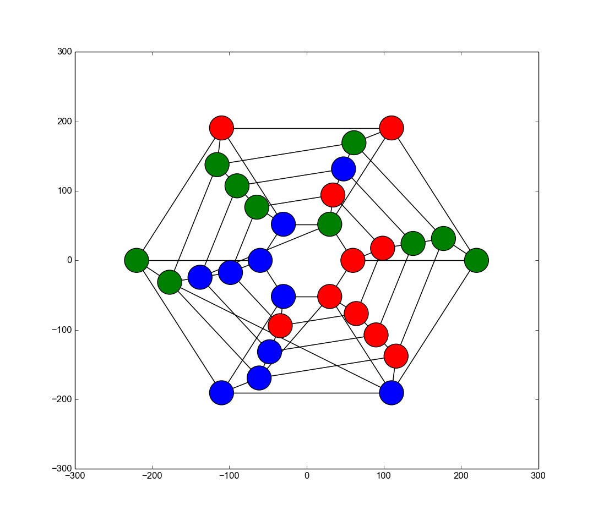

## Network Game Simulations

### About

*This repository stores a collection of my simulation-scripts written in python. The simulations include solving different graph games such as Consensus, Group Formation and Graph Coloring, using autonomous agents (bots) written with different kind of models. Instructions for usage of individual files are written in comments for each file.
If there are questions about the work in this repository, you can contact me via this page or via email (remove white spaces) tuomas . takko  @  aalto .fi*
***

### Files
 * simulator_graphgame.py:
- The simulator for <b>group formation game with the probability matching model</b> as specified in <i>"Bhattacharya, K., Takko, T., Monsivais, D., & Kaski, K. (2018). Role of risk and information in a group formation experiment on a small-world network."</i>
- The script is used to simulate a graph game with bots and to visualize and animate the results of given number of runs with a given number of players in a given network.
***

##### <i>I will be adding more scripts when they are related to publications and/or otherwise interesting!</i>
